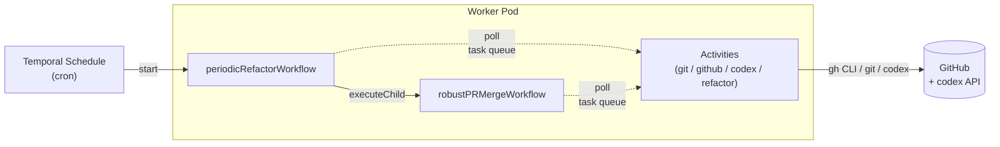
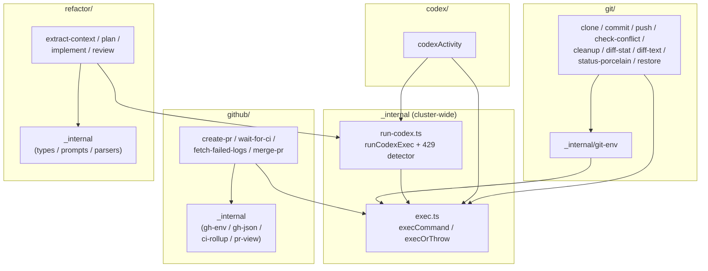
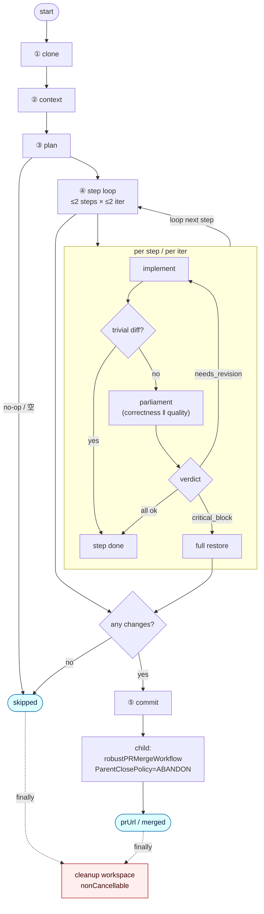
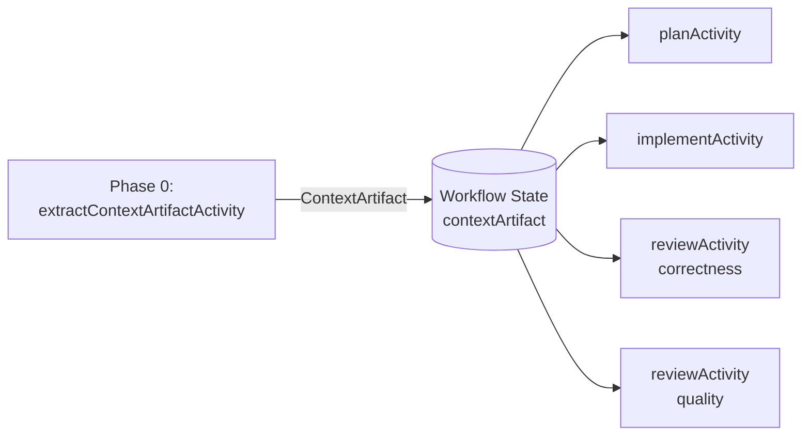

# アーキテクチャ

## 全体構成



> 現在の実装は定期リファクタリング 1 本に絞っており、コード生成側は codex のみ。
> Issue 駆動ルートや別 LLM (claude など) を後で追加したくなったら、`robustPRMergeWorkflow`
> をリユーザブルな子ワークフローとしてそのまま再利用できる。

---

## Activity ディレクトリ構成

`src/activities/` は **「1 ファイル = 1 Activity」** が原則。複数 Activity に共有される
非 Activity ヘルパーはクラスタ直下の `_internal/` に閉じ込め、`activities/index.ts`
バレルからは再 export しない。クラスタは関心の塊で分け、必要に応じてさらに
ネストする。

```
src/activities/
├── index.ts                       # Worker が登録する Activity の barrel
├── _internal/                     # クラスタ横断の共有ヘルパー (非 Activity)
│   ├── exec.ts                    # 子プロセス起動 (heartbeat + cancellation)
│   └── run-codex.ts               # `codex exec` ラッパ + 429 検知 (sandbox 切替対応)
│
├── advisor/                       # 上位モデル相談 (read-only sandbox)
│   ├── index.ts
│   └── advisor.ts                 # consultAdvisorActivity
│
├── codex/                         # 汎用シングルショット codex
│   ├── index.ts
│   └── codex.ts                   # codexActivity (CI 自己修復・コンフリクト解消用)
│
├── git/                           # ワークスペース + git plumbing
│   ├── index.ts
│   ├── _internal/
│   │   └── git-env.ts             # ghAuthEnv / ref ヘルパー
│   ├── clone.ts                   # cloneRepoActivity
│   ├── commit.ts                  # commitAllActivity
│   ├── push.ts                    # pushBranchActivity
│   ├── check-conflict.ts          # checkConflictActivity
│   ├── cleanup.ts                 # cleanupWorkspaceActivity
│   ├── diff-stat.ts               # diffStatActivity (Pre-Parliament gate)
│   ├── diff-text.ts               # diffTextActivity (reviewer 入力)
│   ├── status-porcelain.ts        # statusPorcelainActivity (drift baseline)
│   └── restore.ts                 # restoreActivity (rollback / drift revert)
│
├── github/                        # gh CLI 経由
│   ├── index.ts
│   ├── _internal/
│   │   ├── gh-env.ts              # ghEnv + sleepCancellable
│   │   ├── gh-json.ts             # JSON エラー型
│   │   ├── ci-rollup.ts           # statusCheckRollup の解釈
│   │   └── pr-view.ts             # gh pr view の戻り値パース
│   ├── create-pr.ts               # createPRActivity
│   ├── wait-for-ci.ts             # waitForCIActivity (state も同時取得)
│   ├── fetch-failed-logs.ts       # fetchFailedRunLogsActivity
│   ├── merge-pr.ts                # mergePRActivity (--auto)
│   └── observe-pr-state.ts        # observePRStateActivity (post-merge poll)
│
└── refactor/                      # codex の役割別 Activity
    ├── index.ts
    ├── _internal/
    │   ├── types.ts               # ContextArtifact / PlanStep / etc.
    │   ├── prompts.ts             # 役割別プロンプト (静的先頭 / 動的末尾)
    │   └── parsers.ts             # JSON パーサ (extract / plan / review)
    ├── extract-context.ts         # extractContextArtifactActivity
    ├── plan.ts                    # planActivity
    ├── implement.ts               # implementActivity
    └── review.ts                  # reviewActivity
```

### クラスタの依存関係



`_internal/` の中身は同じクラスタ内のみで使う。クロスクラスタ参照は
`activities/_internal/` に置いた共有 (`exec` / `run-codex`) のみ許す。

---

## Workflow の責務

### `periodicRefactorWorkflow`

5 フェーズ + ステップループ + finally のフロー。守りどころ（リターン経路 / 巻き戻し /
finally）だけを残して、ガード判定・ハウスキープ Activity は省略しています。詳細は
コード（`src/workflows/periodic.ts`）を参照。



省略している保守ロジック（ガード）— コードに存在するが図上は隠している:

- 各 codex spawn 前の `SpawnCounter` 残高チェック（超過なら step ループ脱出）
- iter > 0 で porcelain 出力が前回と完全一致なら「進捗なし」として step を drop
- Parliament 後の drift audit (`statusPorcelain` 再取得 → 増分があれば `restore`)
- `iter == MAX_ITER-1` 到達で needs_revision のままなら step を drop（`dropped-not-converged`）

#### Spawn budget

ワークフロー側で `SpawnCounter` が **`MAX_SPAWNS = 16`** を強制する。
ワーストケース: `1 (context) + 1 (plan) + 2 steps × 2 iter × (1 implement + 2 reviewers) = 14`、
リトライバッファ +2。超過時は新規 spawn を停止し、現状を Phase 3 でレポート。

### `robustPRMergeWorkflow` (Child)


`maxFixIterations` に達するまで CI 失敗・コンフリクトを修復する。
Advisor は `maxAdvisorConsults`（既定 2）が上限。各 advisor 呼び出しは
事前に集約済みのサマリー（≤ 2 KiB）のみを上位モデルに渡し、`{verdict, rationale, suggestedAction}`
を返す。verdict が `abort` のときのみ workflow を停止し、`retry` / `change-strategy`
は次の self-heal を続行する（提案は PR body・ログに記録）。

#### 新しい終了ステータス

`RobustPRMergeOutput.outcome` で `gh pr merge --auto` の挙動と外部干渉を区別する:

| outcome | 意味 | merged フラグ |
| --- | --- | --- |
| `merged` | merge が実際に landed（`mergedAt` を観測） | true |
| `merge-queued` | gh が `--auto` を受理したが、protection の up-to-date 待ちなど未完了 | false |
| `auto-merge-disabled` | 呼び出し側が `autoMerge=false` で停止 | false |
| `closed-externally` | 別 PR / 人間が PR を Close した | false |
| `merged-externally` | base force-push や手動 merge で観測 MERGED | true |

`closed-externally` / `merged-externally` は throw せず正常終了する。CI 待機中に
`gh pr view --json state` で OPEN/CLOSED/MERGED を毎ポーリング読み取り、
状態遷移を early-exit に変換することで「自分の PR より先に他の PR が merge された」
ケースを安全に処理する。

---

## Activity Proxy の対応

| Proxy | startToCloseTimeout | retry | 主な使用 Activity |
| --- | --- | --- | --- |
| `cheap` | 2m | 5回, exp ×2, max 30s | git の軽量 plumbing、gh 単発 read |
| `heavy` | 20m | 4回, exp ×2, max 5m | clone, push |
| `contextCodex` / `planCodex` / `reviewCodex` | 5m | 5回, exp ×3, max 10m | codex 役割活動 (短時間) |
| `implementCodex` | 30m | 5回, exp ×3, max 10m | codex 役割活動 (実装、長時間) |
| `heavyCodex` | 90m | 5回, exp ×3, max 10m | pr-lifecycle の CI 自己修復・コンフリクト解消 |
| `advisor` | 4m | 3回, exp ×2, max 2m | consultAdvisorActivity (上位モデル相談) |
| `ciWait` | 70m | 3回 | waitForCIActivity (heartbeat + ポーリング) |

LLM 系 proxy は全て `codexQuotaFriendlyRetry` を共有し、429 / quota 系エラーを
`RateLimited` 型として受けて指数バックオフで待つ (10 分上限・5 試行)。
`PlannerOutputInvalid`, `MissingCredentials`, `InvalidGitRef` は
`nonRetryableErrorTypes` に列挙して即失敗させる。

---

## Advisor consults（上位モデル相談）

Advisor は **「迷ったときに上位モデルに薄く意見を聞く」** ための単一 Activity
（`consultAdvisorActivity`）。実体は `codex exec --model $ADVISOR_MODEL --sandbox read-only`
の薄いラッパーで、コードを書き換えることはない。ワークフローからは
`workflows/_internal/advisor.ts` の `consultAdvisor()` ヘルパー経由で呼ぶ。

### 起動条件（gate）

| Gate | 場所 | 既定動作 | advisor の verdict が効く場面 |
| --- | --- | --- | --- |
| `ci-self-heal` | pr-lifecycle, iter ≥ 2 で CI red | self-heal を続行 | `abort` で workflow を停止（`AdvisorAbort`） |
| `no-diff` | pr-lifecycle, codex が diff を出さなかった時 | `NoFixDiff` を throw | 監査記録のみ（throw は変えない） |
| `critical-block` | periodic, reviewer が critical_block | 全 restore + 終了 | `retry` だけが効き、needs_revision に降格 |

### I/O 契約

入力（呼び出し側で集約済み・最大 ~2 KiB）:
- `situation`: 1 行で「どの分岐点か」
- `summary`: 失敗ジョブ名・上位 issue・iter 番号などの圧縮済みコンテキスト
- `options`: workflow が選びうる候補（advisor がそれを参考にする）

出力 JSON:
```json
{ "verdict": "retry" | "abort" | "change-strategy", "rationale": "...", "suggested_action": "..." }
```

### 予算（budget）

| Workflow | 既定 cap | 上書き |
| --- | --- | --- |
| `robustPRMergeWorkflow` | `maxAdvisorConsults = 2` | 入力で増減可 |
| `periodicRefactorWorkflow` | `maxAdvisorConsults = 1` | 0 で完全無効化 |

`AdvisorBudget` は `_internal/advisor.ts` の workflow-local カウンタ。**activity を
await する前に consume する** ため、activity が失敗してもカウントは消費される
（指数的なリトライループを防ぐ意図）。

### 失敗モード

advisor の activity が `AdvisorOutputInvalid` を投げた / `RateLimited` リトライ
が尽きた / 単に予算切れ — いずれの場合も `consultAdvisor()` は `reply: undefined`
で audit エントリだけ返す。呼び出し側はそれを「相談しなかった」と等価に扱い、
通常分岐（self-heal 続行 / 全 restore / NoFixDiff throw）にフォールスルーする。

### 監査トレース

各 consult は `AdvisorAuditEntry { gate, situation, reply?, error? }` として
収集され、`PeriodicRefactorOutput.advisorAudits` および
`RobustPRMergeOutput.advisorAudits` に出力される。periodic の `renderReport`
は PR body に **「## Advisor consults」** セクションを生成し、verdict と
rationale を可視化する。子 workflow（pr-lifecycle）の consult は時系列上
PR body 生成より後なので、PR body には載らず periodic 出力経由で観測する。

### 環境変数

`ADVISOR_MODEL` を Worker に設定すると codex がそのモデルで起動する。
未設定なら codex のデフォルトモデルが使われ、advisor は事実上「同モデルでの
2nd opinion」として動く。本番では Opus / GPT-5 級のモデルを推奨。

---

## ContextArtifact パターン



ワークフロー初期に 1 回だけ codex を呼び、リポジトリのサマリー
(`overview / conventions / interfaces`) を `ContextArtifact` として蒸留。
以降の役割プロンプトは全てこの artifact を **静的プリアンブル** に含めるため、
LLM プロバイダのプロンプトキャッシュが plan / implement / review 間で
ヒットする (= 同一バイト列の prefix)。

```
[ STATIC, cacheable ]                                    [ DYNAMIC, per-call ]
┌─────────────────────────────────────────────┐  ┌────────────────────────────┐
│ Global hard rules                            │  │ step JSON / diff /         │
│ Repository Context Artifact                  │  │ prior reviewer feedback    │
│ Role identity + checklist + output schema   │  │                             │
└─────────────────────────────────────────────┘  └────────────────────────────┘
```

---

## 取り扱う状態

### Workspace
`os.tmpdir()/repo-steward-workspaces/<repo>__<random>` に clone する。
`cleanupWorkspaceActivity` が finally で必ず削除。

`baseBranch` は shallow clone 後に `refs/remotes/origin/<baseBranch>` として明示的に fetch し、
その remote-tracking ref から `agent/refactor/<workflow-id>` を作る。これにより、GitHub repo の
default branch ではない `develop` / `release/*` などを Schedule の対象にしても、ローカル branch
未作成による checkout 失敗を避ける。

### Branch 命名
`agent/refactor/<workflow-id>` 形式。Workflow ID は Schedule からの起動毎にユニーク。

---

## Determinism 上の注意

- Workflow からは `Date.now()` / `Math.random()` / `process.env` / 直接 `fs` を呼ばない。
- 待機は `proxyActivities` 越しの heartbeating activity か `sleep()` を使う（`setTimeout` は非推奨）。
- ID は `workflowInfo().workflowId` から導出するか、Activity 側で生成して結果として返す。
- Workflow ファイル直下に副作用のある top-level コードを書かない（`workflowInfo()` も関数内のみで呼ぶ）。
- `extractContextArtifactActivity` の `generatedAt` は `workflowInfo().startTime` から導出 (deterministic)。

---

## 既知の制約と将来検討事項

1. **workdir が Pod ローカル**: 親 Workflow の Activity が確保した `workdir` を子 Workflow が継続利用する設計のため、
   両方が同一 Worker 上で実行される必要がある。スケール時は worker pool を分割するか
   workdir を共有ストレージに置くなどの再設計が必要。
2. **codex CLI の実フラグ**: `codex exec` の引数はバージョン依存。
   CI でバージョン固定し、互換性ブレが起きたら `src/activities/_internal/run-codex.ts` で吸収する。
3. **Replay テストが未整備**: `Worker.runReplayHistory` を使った履歴互換テストを追加すると、
   `pr-lifecycle.ts` のような長寿命ワークフローを安全にバージョンアップできる。
4. **Issue 駆動ルートの再追加**: 将来 `ai-ready` ラベル付き Issue を処理したくなったら、
   `github/list-ai-ready-issues.ts` / `github/update-issue-status.ts` を追加し、
   `issuePollerWorkflow` → `issueDrivenWorkflow` → `robustPRMergeWorkflow` の階層を組む。
5. **別 LLM の再導入**: claude を戻したい場合は `claude/` クラスタを別途追加し、
   `codex/` と並行する Activity Proxy として呼び分ければよい。
   現状は codex 一本で十分なので簡略化している。
