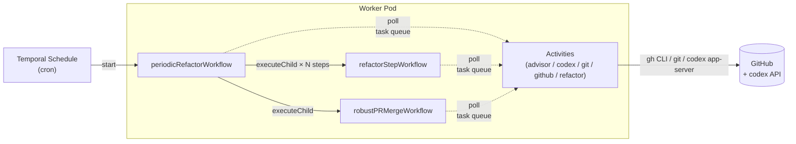
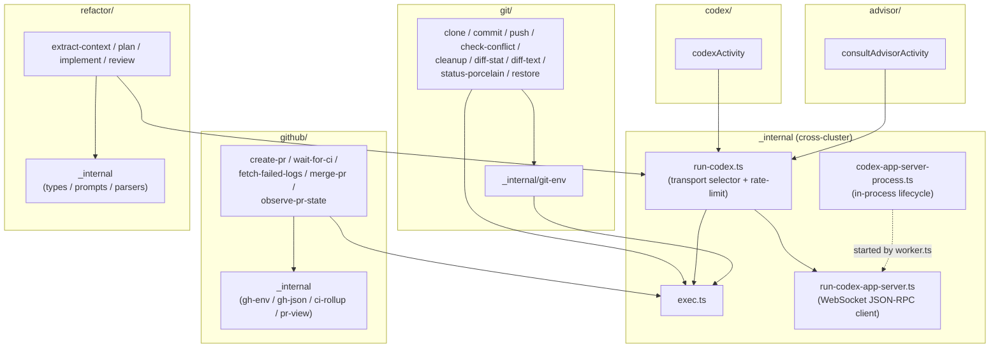
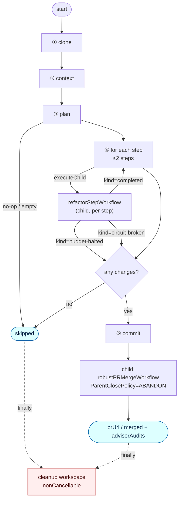
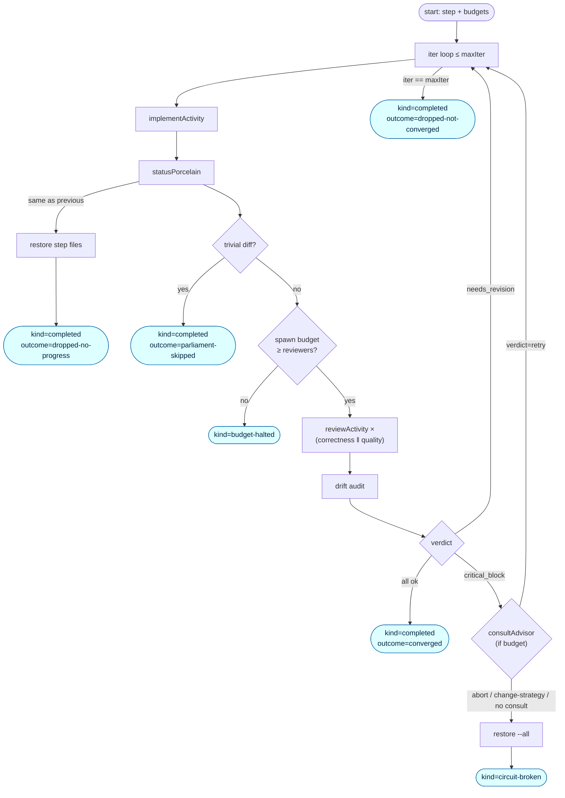
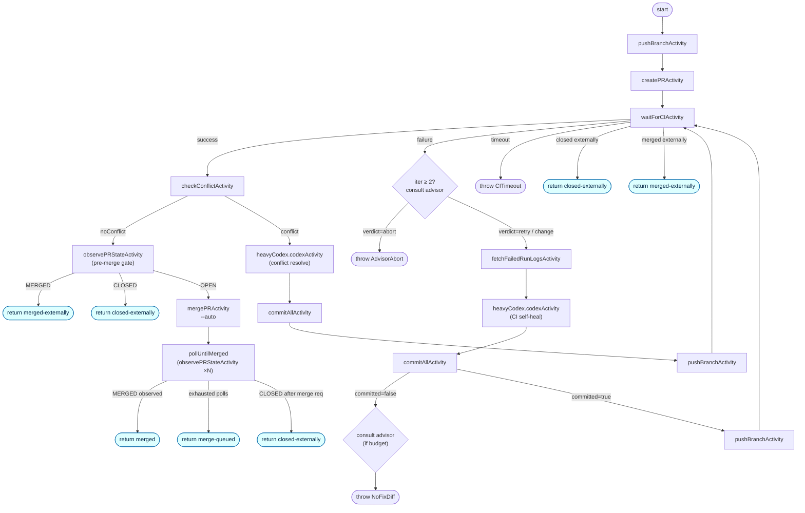
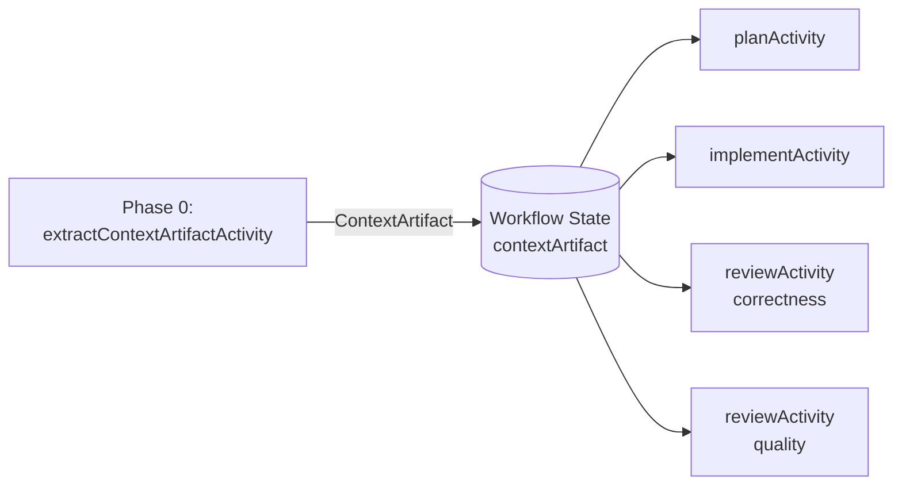

# Architecture

## Overview



> The current implementation is focused on periodic refactoring via codex.  
> `refactorStepWorkflow` (implement → review loop) and `robustPRMergeWorkflow` (push → CI → merge)  
> are designed as reusable child workflows, making it straightforward to add issue-driven routes later.

---

## Activity directory structure

`src/activities/` follows a **one file = one Activity** rule. Helpers shared across Activities live in `_internal/` and are not re-exported from `activities/index.ts`. Clusters are split by concern and nested as needed.

```
src/activities/
├── index.ts                       # Barrel — Activities registered with the Worker
├── _internal/                     # Cross-cluster shared helpers (not Activities)
│   ├── exec.ts                    # Child-process spawner (heartbeat + cancellation)
│   ├── run-codex.ts               # codex transport selector + rate-limit detection
│   ├── run-codex-app-server.ts    # WebSocket JSON-RPC 2.0 client for codex app-server
│   └── codex-app-server-process.ts# In-process codex app-server lifecycle manager
│
├── advisor/                       # Upper-model consult
│   └── advisor.ts                 # consultAdvisorActivity
│
├── codex/                         # Generic single-shot codex
│   └── codex.ts                   # codexActivity (CI self-heal / conflict resolution)
│
├── git/                           # Workspace + git plumbing
│   ├── _internal/
│   │   └── git-env.ts             # ghAuthEnv / ref helpers
│   ├── clone.ts                   # cloneRepoActivity
│   ├── commit.ts                  # commitAllActivity
│   ├── push.ts                    # pushBranchActivity
│   ├── check-conflict.ts          # checkConflictActivity
│   ├── cleanup.ts                 # cleanupWorkspaceActivity
│   ├── diff-stat.ts               # diffStatActivity (Pre-Parliament gate)
│   ├── diff-text.ts               # diffTextActivity (reviewer input)
│   ├── status-porcelain.ts        # statusPorcelainActivity (drift baseline)
│   └── restore.ts                 # restoreActivity (rollback / drift revert)
│
├── github/                        # gh CLI
│   ├── _internal/
│   │   ├── gh-env.ts              # ghEnv + sleepCancellable
│   │   ├── gh-json.ts             # JSON error types
│   │   ├── ci-rollup.ts           # statusCheckRollup interpretation
│   │   └── pr-view.ts             # gh pr view response parser
│   ├── create-pr.ts               # createPRActivity
│   ├── wait-for-ci.ts             # waitForCIActivity (statusCheckRollup + state polling)
│   ├── fetch-failed-logs.ts       # fetchFailedRunLogsActivity
│   ├── merge-pr.ts                # mergePRActivity (--auto)
│   └── observe-pr-state.ts        # observePRStateActivity (pre-merge gate / post-merge poll)
│
└── refactor/                      # Role-specific codex Activities
    ├── _internal/
    │   ├── types.ts               # ContextArtifact / PlanStep / etc.
    │   ├── prompts.ts             # Role prompts (static prefix / dynamic suffix)
    │   └── parsers.ts             # JSON parsers (extract / plan / review)
    ├── extract-context.ts         # extractContextArtifactActivity
    ├── plan.ts                    # planActivity
    ├── implement.ts               # implementActivity
    └── review.ts                  # reviewActivity
```

### Cluster dependencies



`_internal/` contents are used only within the same cluster. Cross-cluster sharing is limited to `activities/_internal/` (`exec`, `run-codex`, `run-codex-app-server`, `codex-app-server-process`).

---

## codex transport

`runCodexExec` in `_internal/run-codex.ts` selects the transport at call time:

- **App-server mode** (default when `CODEX_APP_SERVER_URL` is set): connects to a running `codex app-server` via WebSocket JSON-RPC 2.0. The server is started in-process by `worker.ts` on startup (`startCodexAppServerProcess`). `auth.json` must be mounted in the **worker container**.
- **Subprocess fallback** (when `CODEX_APP_SERVER_URL` is unset and the in-process start fails): spawns `codex exec` directly. `auth.json` must be at `$HOME/.codex/auth.json` (or `$CODEX_HOME/auth.json`).

All codex invocations use `dangerFullAccess` sandbox (`sandboxPolicy: { type: 'dangerFullAccess' }` for app-server; `--sandbox danger-full-access` for subprocess). The Pod is the isolation boundary — it runs non-root with restricted network egress. bubblewrap-based sandbox modes (`workspace-write`, `read-only`) are not used because they require unprivileged user-namespace support that varies by cluster.

---

## Workflow responsibilities

### `periodicRefactorWorkflow`

The orchestrator. Runs five phases: clone → context → plan → step-loop → PR handoff, with a `finally` cleanup block.

The step loop delegates each step's implement → Parliament → drift-audit → critical_block handling to `refactorStepWorkflow` (one child per step via `executeChild`). The parent passes remaining `spawnBudget` / `advisorBudget` to each child and accumulates the deltas returned in the child's output (delta-sync pattern). PR body generation is handled by `_internal/refactor-report.ts` (`renderReport()`); spawn accounting is handled by `_internal/spawn-budget.ts` (`SpawnCounter`).



Guards omitted from the diagram (present in `periodic.ts`):
- Parent checks `SpawnCounter.remaining()` before each child launch; exits loop if 0.
- Child's `spawnCounts` / `advisorConsumed` are delta-synced into parent counters after each child completes.
- On `dropped-not-converged`, parent calls `statusPorcelain` + `restore` to clean up before the next step.

#### Spawn budget

`SpawnCounter` enforces `DEFAULT_PERIODIC_SPAWN_CAP = 16`.  
Worst case: `1 (context) + 1 (plan) + 2 steps × 2 iter × (1 implement + 2 reviewers) = 14`, with +2 retry buffer.  
When the cap is reached, no further spawns occur and the current state is reported in Phase 3.

---

### `refactorStepWorkflow` (child — per step)

Launched once per plan step by `executeChild`. Can be reused as-is by any future orchestrator.



Return value fields:

| Field | Type | Meaning |
| --- | --- | --- |
| `kind` | `'completed' \| 'budget-halted' \| 'circuit-broken'` | Whether the parent should continue to the next step |
| `record` | `StepRecord?` | Undefined only when `kind === 'budget-halted'` |
| `circuitBroken` | `CircuitBreaker?` | Set only when `kind === 'circuit-broken'` |
| `spawnCounts` | `Record<string, number>` | codex calls consumed by this child, by role |
| `advisorConsumed` | `number` | Advisor consults consumed by this child |
| `advisorAudits` | `AdvisorAuditEntry[]` | Audit entries for advisor consults in this child |

`workdir` is passed from the parent and used as-is (both run on the same Worker pod).

---

### `robustPRMergeWorkflow` (child)



Repairs CI failures and conflicts up to `maxFixIterations`. The advisor is called at most `maxAdvisorConsults` times (default 2) — once for CI self-heal (when `iter ≥ 2`) and once for no-diff. Each advisor call receives only a pre-aggregated summary (≤ 2 KiB). Only `verdict: abort` stops the workflow; `retry` and `change-strategy` continue to the next self-heal (the suggestion is recorded in the audit log and PR body).

#### `RobustPRMergeOutput.outcome` values

| Outcome | Meaning | `merged` flag |
| --- | --- | --- |
| `merged` | Merge landed — `mergedAt` was observed | `true` |
| `merge-queued` | `--auto` accepted by gh but protection gate not yet cleared | `false` |
| `auto-merge-disabled` | Caller passed `autoMerge: false` | `false` |
| `closed-externally` | PR was closed by another PR or a person | `false` |
| `merged-externally` | Base force-push or manual merge — MERGED observed | `true` |

`closed-externally` and `merged-externally` return normally (no throw). Each CI poll reads `gh pr view --json state` to detect external OPEN/CLOSED/MERGED transitions, converting them into early exits.

---

## Activity proxy mapping

| Proxy | `startToCloseTimeout` | Retries | Activities |
| --- | --- | --- | --- |
| `cheap` | 2 m | 5×, exp ×2, max 30 s | lightweight git plumbing, single gh reads |
| `heavy` | 20 m | 4×, exp ×2, max 5 m | clone, push |
| `contextCodex` / `planCodex` / `reviewCodex` | 5 m | 5×, exp ×3, max 10 m | short codex roles |
| `implementCodex` | 30 m | 5×, exp ×3, max 10 m | implement role (longer) |
| `heavyCodex` | 90 m | 5×, exp ×3, max 10 m | CI self-heal / conflict resolution in pr-lifecycle |
| `advisor` | 4 m | 3×, exp ×2, max 2 m | consultAdvisorActivity |
| `ciWait` | 70 m | 3× | waitForCIActivity (heartbeat + polling) |

All LLM proxies share `codexQuotaFriendlyRetry`: `RateLimited` errors get exponential backoff (up to 10 min, 5 attempts). `PlannerOutputInvalid`, `MissingCredentials`, and `InvalidGitRef` are in `nonRetryableErrorTypes` — they fail immediately regardless of proxy retry policy.

---

## Advisor consults

The advisor is a single Activity (`consultAdvisorActivity`) that queries a higher-capability model for a decision at specific workflow gates. It never modifies code — it only returns `{verdict, rationale, suggested_action}`. Workflows call it via `consultAdvisor()` in `workflows/_internal/advisor.ts`.

### Invocation gates

| Gate | Location | Default behavior | Advisor effect |
| --- | --- | --- | --- |
| `ci-self-heal` | pr-lifecycle, CI red at iter ≥ 2 | continue self-heal | `abort` throws `AdvisorAbort` |
| `no-diff` | pr-lifecycle, codex produced no diff | throw `NoFixDiff` | audit record only (throw is unchanged) |
| `critical-block` | periodic, reviewer returns `critical_block` | restore all + exit | only `retry` takes effect (demotes to `needs_revision`) |

### I/O contract

Input (aggregated by caller, ≤ ~2 KiB):
- `situation`: one line describing the decision point
- `summary`: compressed context (failed job names, top issues, iteration count, etc.)
- `options`: candidate actions the workflow could take

Output JSON:
```json
{ "verdict": "retry" | "abort" | "change-strategy", "rationale": "...", "suggested_action": "..." }
```

### Budget

| Workflow | Default cap | Override |
| --- | --- | --- |
| `robustPRMergeWorkflow` | `maxAdvisorConsults = 2` | Configurable in input |
| `periodicRefactorWorkflow` | `maxAdvisorConsults = 1` | `0` to disable entirely |

`AdvisorBudget` is a workflow-local counter in `_internal/advisor.ts`. It is **consumed before the Activity is awaited**, so a failed activity still counts against the budget (this prevents exponential retry loops).

### Failure modes

If `consultAdvisorActivity` throws `AdvisorOutputInvalid`, exhausts retries on `RateLimited`, or the budget is zero, `consultAdvisor()` returns `reply: undefined` with an audit entry. The caller treats this as "no consult" and falls through to the default branch (continue self-heal / restore all / throw `NoFixDiff`).

### Audit trace

Each consult is recorded as `AdvisorAuditEntry { gate, situation, reply?, error? }` and collected in `PeriodicRefactorOutput.advisorAudits` / `RobustPRMergeOutput.advisorAudits`. `renderReport()` adds an **"## Advisor consults"** section to the PR body showing verdict and rationale. Consults from pr-lifecycle occur after PR body generation, so they appear only in the workflow output, not in the PR body.

---

## ContextArtifact pattern



At workflow start, a single codex call distils a repository summary (`overview / conventions / interfaces`) into a `ContextArtifact`. All subsequent role prompts include this artifact as a **static preamble**, so the LLM provider's prompt cache hits across plan / implement / review calls within the same workflow run (same prefix bytes).

```
[ STATIC, cacheable ]                                    [ DYNAMIC, per-call ]
┌─────────────────────────────────────────────┐  ┌────────────────────────────┐
│ Global hard rules                            │  │ step JSON / diff /         │
│ Repository Context Artifact                  │  │ prior reviewer feedback    │
│ Role identity + checklist + output schema   │  │                             │
└─────────────────────────────────────────────┘  └────────────────────────────┘
```

---

## State management

### Workspace

Repos are cloned to `os.tmpdir()/repo-steward-workspaces/<repo>__<random>` (or `$WORKSPACE_ROOT/<repo>__<random>` when `WORKSPACE_ROOT` is set). `cleanupWorkspaceActivity` removes it in the `finally` block.

`baseBranch` is explicitly fetched as `refs/remotes/origin/<baseBranch>` after the shallow clone, and `agent/refactor/<workflow-id>` is checked out from that remote-tracking ref. This avoids `git checkout` failures on repos where `develop`, `release/*`, etc. are not the default branch.

### Branch naming

`agent/refactor/<workflow-id>` — unique per schedule invocation via `workflowInfo().workflowId`.

---

## Determinism constraints

- Workflows must not call `Date.now()`, `Math.random()`, `process.env`, or `fs` directly.
- Use heartbeating Activities or `workflow.sleep()` for waiting. `setTimeout` is not safe in Workflows.
- Generate IDs from `workflowInfo().workflowId` or return them from Activities.
- Do not place side-effectful code at the top level of a workflow file. Even `workflowInfo()` must be called inside a function.
- `extractContextArtifactActivity`'s `generatedAt` is derived from `workflowInfo().startTime` (deterministic).

---

## Activities catalog

All Activities registered with the Worker. `src/activities/index.ts` is the source of truth. The proxy column refers to the `proxyActivities` group in `src/workflows/proxies.ts`.

### `git/` — workspace + git plumbing

| Activity | File | Proxy | Role |
| --- | --- | --- | --- |
| `cloneRepoActivity` | `git/clone.ts` | `heavy` | Shallow clone + create `agent/refactor/<id>` branch |
| `commitAllActivity` | `git/commit.ts` | `heavy` | `git add -A` + commit. Returns `committed: false` on empty diff |
| `pushBranchActivity` | `git/push.ts` | `heavy` | `git push` (supports `-u` / `--force-with-lease`) |
| `checkConflictActivity` | `git/check-conflict.ts` | `cheap` | Trial merge against base → list conflicting files |
| `cleanupWorkspaceActivity` | `git/cleanup.ts` | `cheap` | Delete workdir in finally block |
| `diffStatActivity` | `git/diff-stat.ts` | `cheap` | `--shortstat` for Pre-Parliament gate |
| `diffTextActivity` | `git/diff-text.ts` | `cheap` | Full diff text for reviewers (truncated at `maxBytes`) |
| `statusPorcelainActivity` | `git/status-porcelain.ts` | `cheap` | Porcelain snapshot for drift detection |
| `restoreActivity` | `git/restore.ts` | `cheap` | Without `paths`: restore all files (critical_block rollback) |

### `github/` — gh CLI

| Activity | File | Proxy | Role |
| --- | --- | --- | --- |
| `createPRActivity` | `github/create-pr.ts` | `cheap` | `gh pr create` + view to get `{number, url}` |
| `waitForCIActivity` | `github/wait-for-ci.ts` | `ciWait` | Poll `statusCheckRollup` + `state`. Detects external close/merge |
| `fetchFailedRunLogsActivity` | `github/fetch-failed-logs.ts` | `cheap` | `gh run view --log-failed` (input to codex self-heal) |
| `mergePRActivity` | `github/merge-pr.ts` | `cheap` | `gh pr merge --auto --squash --delete-branch` |
| `observePRStateActivity` | `github/observe-pr-state.ts` | `cheap` | `gh pr view --json state,mergedAt` (pre-merge gate + post-merge poll) |

### `codex/` / `refactor/` / `advisor/` — LLM

| Activity | File | Proxy | Role |
| --- | --- | --- | --- |
| `codexActivity` | `codex/codex.ts` | `heavyCodex` | CI self-heal and conflict resolution in pr-lifecycle |
| `extractContextArtifactActivity` | `refactor/extract-context.ts` | `contextCodex` | Distil repo summary once at workflow start |
| `planActivity` | `refactor/plan.ts` | `planCodex` | Decompose theme into ≤2 steps |
| `implementActivity` | `refactor/implement.ts` | `implementCodex` | Apply one step to the working tree |
| `reviewActivity` | `refactor/review.ts` | `reviewCodex` | Per-concern reviewer (correctness / quality) |
| `consultAdvisorActivity` | `advisor/advisor.ts` | `advisor` | Upper-model consult (gate-based, budget-capped) |

---

## Configuration reference

### Worker environment variables

| Variable | Required | Default | Purpose |
| --- | --- | --- | --- |
| `TEMPORAL_ADDRESS` | yes | `localhost:7233` | Temporal Frontend gRPC endpoint |
| `TEMPORAL_NAMESPACE` | no | `default` | Temporal namespace |
| `TEMPORAL_TASK_QUEUE` | no | `repo-steward` | Shared queue name for Worker and Client |
| `TEMPORAL_TLS` | no | `false` | Set `true` to enable mTLS |
| `TEMPORAL_MAX_CONCURRENT_ACTIVITIES` | no | `4` | Activity slot count (directly affects codex parallelism) |
| `TEMPORAL_MAX_CONCURRENT_WORKFLOWS` | no | `20` | Workflow task slot count |
| `NODE_ENV` | no | (unset) | `production` requires a pre-built workflow bundle |
| `GITHUB_TOKEN` | yes | — | Auth for `gh` and `git push`. Fine-grained PAT recommended |
| `GIT_BOT_NAME` | yes | — | `user.name` for auto-commits. Missing → `MissingCredentials` at startup |
| `GIT_BOT_EMAIL` | yes | — | `user.email` for auto-commits. Missing → `MissingCredentials` at startup |
| `CODEX_HOME` | no | `~/.codex` | Override the directory where `auth.json` is read |
| `CODEX_APP_SERVER_URL` | no | (auto) | WebSocket URL of the codex app-server. Set automatically by `worker.ts` when the in-process server starts. Override to point at an external server |
| `WORKSPACE_ROOT` | no | `os.tmpdir()/repo-steward-workspaces` | Root directory for cloned repos. Set to a mounted volume path when you want size-limited workspace storage |
| `ADVISOR_MODEL` | no | (codex default) | Model name passed to `codex --model` for advisor consults. Use Opus or equivalent in production |

### `periodicRefactorWorkflow` input (`PeriodicRefactorInput`)

| Field | Type | Default | Description |
| --- | --- | --- | --- |
| `repoFullName` | `string` | required | `owner/name` |
| `baseBranch` | `string?` | `main` | Base ref to clone and target for merge |
| `refactorBrief` | `string?` | (none) | User instructions passed to the planner. If empty, the planner selects the theme freely |
| `autoMerge` | `boolean?` | `true` | `false` stops just before merge, returning `outcome: 'auto-merge-disabled'` |
| `maxAdvisorConsults` | `number?` | `1` | Maximum advisor consult calls. `0` disables entirely |

### `refactorStepWorkflow` input (`RefactorStepInput`)

| Field | Type | Default | Description |
| --- | --- | --- | --- |
| `step` | `PlanStep` | required | One step from the planner's output |
| `workdir` | `string` | required | Workspace path provisioned by the parent |
| `contextArtifact` | `ContextArtifact` | required | Repo summary for prompt-cache prefix |
| `spawnBudget` | `number` | required | codex calls this child may consume (parent's remaining count) |
| `advisorBudget` | `number` | required | Advisor consults this child may consume |
| `config` | `StepLoopConfig` | required | `maxIter`, `trivialLineThreshold`, `reviewerConcerns`, etc. |

See the flow diagram and return-value table above for `RefactorStepOutput` fields.  
After each child completes, the parent calls `SpawnCounter.consume()` and `AdvisorBudget.addConsumed()` with the deltas, and appends `advisorAudits`.

### `robustPRMergeWorkflow` input (`RobustPRMergeInput`)

| Field | Type | Default | Description |
| --- | --- | --- | --- |
| `repoFullName` | `string` | required | `owner/name` |
| `workdir` | `string` | required | Workspace path provisioned by the parent |
| `branch` | `string` | required | Branch to push |
| `baseBranch` | `string` | required | Merge target |
| `prTitle` / `prBody` | `string` | required | PR display text |
| `maxFixIterations` | `number?` | `8` | Combined CI self-heal + conflict resolution iteration cap |
| `autoMerge` | `boolean?` | `true` | `false` → `outcome: 'auto-merge-disabled'` |
| `maxAdvisorConsults` | `number?` | `2` | Advisor cap (`ci-self-heal` and `no-diff` each consume one) |
| `postMergePollAttempts` | `number?` | `6` | Maximum merge-observation poll count |
| `postMergePollIntervalMs` | `number?` | `10_000` | Poll interval in milliseconds |

### Workflow hard-coded constants

| Constant | Location | Value | Meaning |
| --- | --- | --- | --- |
| `DEFAULT_PERIODIC_SPAWN_CAP` | `workflows/_internal/spawn-budget.ts` | `16` | Total codex call cap (context + plan + impl + review combined) |
| `MAX_STEPS` | `periodic.ts` | `2` | Maximum steps taken from the planner output |
| `STEP_LOOP_CONFIG.maxIter` | `periodic.ts` | `2` | implement → review loop iteration cap per step |
| `STEP_LOOP_CONFIG.trivialLineThreshold` | `periodic.ts` | `30` | Diffs below this (ins+del) skip Parliament |
| `STEP_LOOP_CONFIG.trivialFileThreshold` | `periodic.ts` | `3` | Diffs below this file count skip Parliament |
| `STEP_LOOP_CONFIG.reviewDiffBytes` | `periodic.ts` | `8 * 1024` | Maximum diff bytes passed to reviewers |
| `STEP_LOOP_CONFIG.reviewerConcerns` | `periodic.ts` | `['correctness', 'quality']` | Parliament reviewer roles |
| `CI_POLL_INTERVAL_SECONDS` | `pr-lifecycle.ts` | `30` | `waitForCIActivity` polling interval |
| `CI_MAX_WAIT_SECONDS` | `pr-lifecycle.ts` | `3600` | CI wait upper bound (exceeded → `CITimeout`) |
| `POST_MERGE_POLL_ATTEMPTS` | `pr-lifecycle.ts` | `6` | Default merge-observation poll count |
| `POST_MERGE_POLL_INTERVAL_MS` | `pr-lifecycle.ts` | `10_000` | Default poll interval |

---

## ApplicationFailure type catalog

`ApplicationFailure.type` values visible in the Temporal Web UI. "Retryable?" shows whether the error is retried at the Activity level. `nonRetryable` errors ignore the proxy's RetryPolicy and fail immediately. `workflow throw` errors terminate the Workflow itself.

| Type | Thrown by | Retryable? | Meaning and resolution |
| --- | --- | --- | --- |
| `MissingCredentials` | `gh-env.ts` / `git-env.ts` / `run-codex.ts` | No (nonRetryable) | `GITHUB_TOKEN` missing or `auth.json` absent. Fix the Worker environment |
| `InvalidGitRef` | `git-env.ts` | No (nonRetryable) | Base branch is empty. Fix the Schedule input |
| `InvalidGitHubOutput` | `gh-json.ts` | No (nonRetryable) | Unexpected gh CLI JSON. Check gh version or API changes |
| `PlannerOutputInvalid` | `refactor/_internal/parsers.ts` | No (nonRetryable) | Planner returned non-JSON. Likely a prompt or model issue. periodic lands on `skipped: 'plan-failed'` |
| `AdvisorOutputInvalid` | `advisor/advisor.ts` | No (nonRetryable, excluded in proxy) | Advisor returned non-JSON. Treated as `reply: undefined`; normal branch continues |
| `RateLimited` | `run-codex.ts` / `run-codex-app-server.ts` | **Yes** | codex rate-limited (429 / quota text detected). `codexQuotaFriendlyRetry` applies exponential backoff |
| `CodexInvocationError` | `run-codex.ts` / `run-codex-app-server.ts` | **Yes** | Non-zero codex exit or RPC error, not rate-limited. Workflow fails if retries are exhausted |
| `CITimeout` | `pr-lifecycle.ts` (workflow) | No (workflow throw) | CI did not settle within `CI_MAX_WAIT_SECONDS`. Check GitHub Actions |
| `AdvisorAbort` | `pr-lifecycle.ts` (workflow) | No (workflow throw) | Advisor returned `verdict: abort` at iter ≥ 2. Intentional early stop |
| `NoFixDiff` | `pr-lifecycle.ts` (workflow) | No (workflow throw) | codex claimed a fix but diff is empty. Check prompt / sandbox |
| `MaxIterationsExceeded` | `pr-lifecycle.ts` (workflow) | No (workflow throw) | `maxFixIterations` exhausted without reaching CI green |

`MissingCredentials`, `InvalidGitRef`, `PlannerOutputInvalid`, and `AdvisorOutputInvalid` are listed in `nonRetryableErrorTypes` in `proxies.ts`, so they fail on the first attempt even through proxy retry policies.

---

## Known limitations and future work

1. **workdir is pod-local**: The parent Workflow provisions `workdir` and passes it to child Workflows, which assumes all of them run on the same Worker pod. When scaling, either pin Workflows to pods, move `workdir` to shared storage, or re-clone in each child.
2. **codex CLI flags are version-sensitive**: Arguments are matched to the documented API at build time. Pin the version in CI; absorb breaking changes in `_internal/run-codex.ts` and `_internal/run-codex-app-server.ts`.
3. **Replay tests not set up**: `tests/fixtures/replay/` is a placeholder. Adding `Worker.runReplayHistory` CI checks would make it safe to version long-lived Workflows like `pr-lifecycle.ts`.
4. **Issue-driven route**: To handle `ai-ready`-labelled issues, add `github/list-ai-ready-issues.ts` / `github/update-issue-status.ts` and build `issuePollerWorkflow` → `issueDrivenWorkflow` → `robustPRMergeWorkflow`.
5. **Alternative LLM**: To add Claude or another model, add a separate Activity cluster and a corresponding proxy. The current codex-only setup is intentional; the architecture does not preclude adding more.
6. **`change-strategy` verdict is treated as `retry`**: The suggested action is recorded in the audit log but has no distinct runtime effect. A future branch could implement concrete actions (e.g. convert PR to draft, apply a different prompt strategy).
